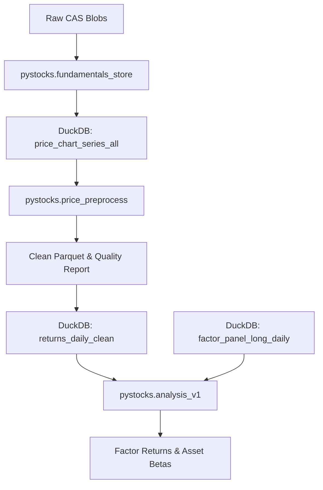

# Tail Pipeline (Analysis V1)

This document describes the "tail" of the PyStocks pipeline: transforming raw price/fundamental data into clean factor returns and asset betas.

## 1. Quick Start

Run the full sequence (preprocessing + analysis) in one command:

```bash
python -m pystocks.cli run_tail_pipeline
```

## 2. Pipeline Stages

### Stage 1: Price Preprocessing (`preprocess_prices`)

**Goal:** Create a clean, point-in-time adjusted daily return series for every eligible instrument.

**Inputs:**
- `price_chart_series_all` (DuckDB view): Raw price points from `mf_performance_chart`.

**Operations:**
1. **Deduplication:** Resolves multiple scrapes for the same trade date by taking the latest `effective_at` / `observed_at`.
2. **Quality Flags:**
   - Marks non-positive prices.
   - Marks inconsistent OHLC (e.g., Low > High).
   - Marks stale runs (flat price for > 5 days).
   - Marks outliers (Modified Z-Score > 50.0).
3. **Eligibility Gating:**
   - Requires min 252 valid days of history.

**Outputs:**
- `data/prices/ibkr_mf_performance_chart_clean/`: Partitioned Parquet files of clean prices.
- `data/research/price_quality_report_latest.json`: Summary of eligibility and quality stats.
- `data/research/price_quality_catalog.parquet`: Parquet version of the quality report.
- DuckDB Views: `price_chart_series_clean_all`, `returns_daily_clean`, `price_quality_catalog`.

### Stage 2: Factor Analysis (`run_analysis_v1`)

**Goal:** Construct daily factor portfolios and regress asset returns against them to derive betas.

**Inputs:**
- `returns_daily_clean` (DuckDB view)
- `factor_panel_long_daily` (DuckDB view): Point-in-time fundamental features.
- Risk-Free Rate: Computed dynamically from Bond ETFs in the universe (fallback to 0.0).

**Factor Construction:**
1. **Market (Mkt-RF):** Equal-weighted average of equity universe minus risk-free rate.
2. **SMB (Small Minus Big):** `marketcap_small` dummy portfolio minus `marketcap_large` dummy portfolio.
3. **HML (High Minus Low):** `style_value` dummy portfolio minus `style_growth` dummy portfolio.
4. **Screening:** Factors with correlation > 0.95 are deterministically dropped.

**Regression:**
- Model: ElasticNetCV (L1/L2 regularization).
- Min History: 60 days.

**Outputs:**
- `data/research/factor_returns_daily_latest.parquet`: Daily returns for constructed factors.
- `data/research/asset_factor_betas_latest.parquet`: Regression betas and R2 for each asset.
- `data/research/analysis_summary_latest.json`: Metadata about the run.

## 3. Data Flow Diagram



## 4. Troubleshooting

**Empty Analysis Output?**
- Check `price_quality_catalog` view: `SELECT count(*) FROM price_quality_catalog WHERE eligible=true`.
- If 0 eligible, check your scrape coverage. You need at least 252 days of history.

**"No Bond ETFs found"?**
- The system looks for `asset_bond >= 0.9` in `factor_features_latest`. Ensure you have scraped bond ETFs.
- Fallback is 0.0 risk-free rate, which is acceptable for relative analysis.

**Date Mismatch Errors?**
- Ensure you have run `python -m pystocks.fundamentals_store backfill_price_chart_series` to fix legacy date parsing issues (prioritizing `x` timestamp).
